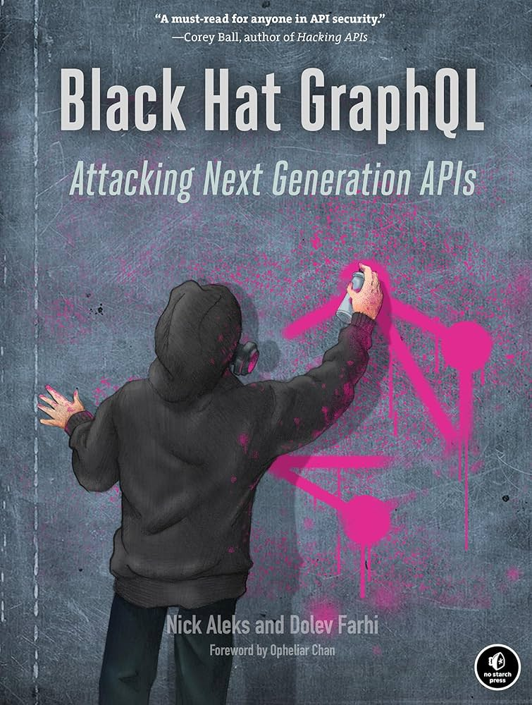

# Black Hat GraphQL
Book files for **Black Hat GraphQL**.

<table>
  <tr>
    <td style="vertical-align:top;width:40%">
      
    </td>
    <td style="vertical-align:top;width:60%">
      
<strong>Black Hat GraphQL</strong> is for anyone interested in learning how to break and protect GraphQL APIs with the aid of offensive security testing. Whether you’re a penetration tester, security analyst, or software engineer, you’ll learn how to attack GraphQL APIs, develop hardening procedures, build automated security testing into your development pipeline, and validate controls, all with no prior exposure to GraphQL required.

      
<a href="https://nostarch.com/black-hat-graphql" target="_blank">Buy the book from No Starch Press</a>

    </td>
  </tr>
</table>

Enjoy!

***

## Errata
* Page 83 Listing 4-14: `grep` command should be corrected to: `grep -Hnio "graphiql\|graphql-playground" dvga-report/source/*`
* Page 112: The sentence "_In DVGA, run the following query [...]_" should read: "_In **Altair**, run the following query [...]_".
* Page 177: The `COOKIES` variable value should read `{"session":"session-secret"}`

## Notes
* Due to changes in InQL, you may need to install the tool from the its V4 branch, latest version being [4.0.7](https://github.com/doyensec/inql/releases/tag/v4.0.7)
